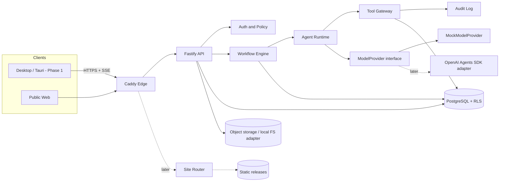

# Deedwell — Required First Response (BRD §25)

This document is the pre-implementation analysis the BRD requires before code is written.
It is honest about what is built in this repository today versus what is designed-for-later.

---

## 1. Executive Interpretation

Deedwell is an AI workforce platform for nonprofits: one workspace where a small nonprofit
gets a coordinated team of role-scoped AI agents that produce **durable, versioned artifacts**
(grant applications, compliance matrices, budgets, websites) — not chat transcripts.

The three load-bearing ideas, in priority order:

1. **Tenancy and authorization are the foundation.** Everything else composes on top of a
   tenant-scoped, RLS-enforced data model with auditable human and agent identity on every action.
2. **Deterministic workflows with bounded agentic steps.** The workflow engine owns state,
   transitions, retries, and approval gates; agents do professional work *inside* stages.
3. **Evidence before eloquence.** Grant content is traceable to requirements and evidence;
   unsupported claims are flagged, never silently shipped.

The correct first build is therefore: tenant/auth foundation → durable workflow engine →
tool gateway → one end-to-end grant vertical slice. Screens come after boundaries.

## 2. Critical Assumptions

- A1: Single-server Hetzner Docker Compose is acceptable for private beta; HA comes later (BRD §11.2 agrees).
- A2: Model providers are replaceable; the MVP must run **deterministically without any
  model API key** via a clearly-marked mock provider (required for CI and evaluation baselines).
- A3: Grant opportunity documents arrive as text-extractable files; OCR is deferred behind `DocumentParser`.
- A4: The desktop app (Tauri) is a client of the same HTTP/SSE API built here; building the API
  first does not block Phase 1.
- A5: A custom Postgres-backed durable workflow engine is sufficient for the vertical slice,
  provided it hides behind a `WorkflowEngine` interface that Temporal can later implement (ADR-0002).

## 3. Contradictions and Risks Identified in the BRD

| # | Issue | Resolution |
|---|-------|------------|
| R1 | §7.2 mandates OpenAI Agents SDK, §2.7 mandates provider portability | The abstraction (`ModelProvider`, `AgentRuntime`) is the contract; OpenAI Agents SDK is *an implementation* plugged in behind it. This repo ships the contract + a mock implementation; the SDK adapter is a marked TODO, never faked. |
| R2 | §7.2 mandates Temporal; §22 Phase 0/2 scope is small | Temporal adds heavy operational surface for a vertical slice. We ship a Postgres-backed durable engine implementing the same semantics (persist, resume, retry, approval-wait, idempotency) behind `WorkflowEngine`. ADR-0002 records the swap path. Risk: divergence from Temporal semantics — mitigated by keeping activities idempotent and state transitions explicit. |
| R3 | "Chat is the CMS" vs "structured content model" | Structured records are canonical; chat emits **proposed patches** against them. Never store facts only in transcripts. |
| R4 | Voice huddles + distinct voices are far ahead of the security foundation | Deferred to Phase 6 as the BRD phases already imply; `VoiceProvider` interface reserved. |
| R5 | Eligibility must "never treat missing info as eligibility" but LLMs happily guess | Eligibility is a **deterministic rule evaluation** over typed facts; the model only extracts/normalizes, never decides. Statuses include `insufficient_information`. |
| R6 | Preview sites on subdomains can steal app cookies if same-origin | Separate origin for previews (`*.preview.deedwell.app` vs app domain), strict CSP, no app cookies scoped there. Enforced in Caddy config. |
| R7 | On-demand TLS for customer domains is a certificate-issuance DoS vector | Caddy `ask` endpoint does an indexed lookup against the approved-domain registry only. |

## 4. Recommended Architecture

Modular monolith API + workers around Postgres, with hard interfaces at every external seam.

- **apps/api** — Fastify HTTP API: auth, tenancy, projects, files, workflows, artifacts, approvals, exports. SSE for realtime events (WebSocket gateway later).
- **packages/workflows** — durable workflow engine (Postgres-backed): definitions, runs, steps, retries, approval gates, resume-after-crash. Worker loop can run in-process (dev) or as a separate `worker-agent` process (prod).
- **packages/agent-runtime** — `ModelProvider` / `AgentRuntime` abstractions + `MockModelProvider` (deterministic, clearly marked). Agent definitions are typed data, versioned.
- **packages/tools** — Tool Gateway: every agent tool call passes through registration, tenant/user/agent identity, scope validation (zod), policy checks, budget checks, audit logging.
- **packages/database** — pg pool, migrations, Row-Level Security, tenant-scoped query helpers.
- **packages/schemas** — zod schemas shared by API, workflows, agents, and (later) the desktop client.
- **packages/auth** — password hashing (scrypt), opaque session tokens (hashed at rest), role checks.
- **packages/grant-domain** — the Grant Team vertical slice: requirements extraction, compliance matrix, missing-info detection, section drafting with claim flagging.
- **infrastructure/** — Docker Compose (Postgres, Redis, API, Caddy), Caddy config with approved-domain TLS gate.

## 5. System Diagram



## 6. Tenant Isolation Design

- Every tenant-owned table carries `tenant_id uuid not null` (organizations are the tenant unit).
- **Postgres RLS** enabled on all tenant tables; policies compare against `current_setting('app.tenant_id')`. The app sets it per-transaction after resolving the session → membership.
- The application runs as a non-superuser role (`deedwell_app`) that cannot bypass RLS; migrations run as owner.
- Object-storage keys are prefixed `tenants/<tenant_id>/…` and only generated server-side.
- Tool Gateway stamps `{tenant_id, user_id, agent_id}` on every call; a call without tenant context is rejected.
- Mandatory automated cross-tenant tests (`tests/security/`) prove org A cannot read org B via API or direct SQL under the app role.

## 7. Agent-Harness Design

- **Agent definitions** are typed, versioned records (id, role, instructions, allowed tools, budgets, output schema).
- **Workflow stages** call `runAgentTask(agentDef, task, context)`; the runtime builds a minimal context (never the whole org DB), invokes the `ModelProvider`, validates output against the agent's zod output schema, and retries on schema failure.
- **Handoffs** are explicit workflow steps carrying {task, objective, context, required output, completion criteria} — recorded and auditable.
- **Approval gates** are workflow states (`waiting_approval`) that persist and resume; agents cannot pass them.
- **Budgets**: token/step budgets recorded per run; exceeded budget → run is suspended, surfaced, and requires human action.

## 8. Website Deployment Design (Phase 4–5, designed now)

Static-first multi-tenant hosting: builds run in ephemeral sandboxes producing static release
artifacts; a Site Router resolves `Host → (tenant, site, active release)` from an indexed domain
table; Caddy terminates TLS and only issues certs for registry-approved domains. No permanent
per-tenant containers. Not implemented in this slice; interfaces and the domain tables are in the data model.

## 9. Grant Workflow State Machine (vertical slice subset)

```
created → parsing_document → extracting_requirements → checking_org_info
   → [waiting_for_info]* → building_compliance_matrix → drafting_section
   → waiting_approval → (approved → exporting → completed | rejected → drafting_section)
Failures at any step → step retry (bounded) → run `failed` with resumable state.
```

Full Phase 3 workflow follows BRD §8.3 stages 1–15; each stage is a workflow definition version.

## 10. Threat Model Summary

See `THREAT_MODEL.md`. Top risks: cross-tenant leakage (RLS + gateway + tests), prompt injection
from uploaded documents (instruction/data separation, output schema validation, no tool escalation
from document content), secret exposure (env-only secrets, redacting logger), approval bypass
(server-side gates, not UI), TLS issuance abuse (approved-domain registry), agent overreach
(tool allowlists + budgets + audit).

## 11. Proposed Data Model

See `DATA_MODEL.md` and `packages/database/migrations/`. Implemented now: identity/tenancy,
projects, files, workflow engine tables, artifacts + versions, approvals, audit events,
grant opportunities/requirements/sections, agent definitions, tool audit. Designed-not-yet-migrated:
websites/domains, huddles, billing (schemas documented, migrations deferred to their phases).

## 12. Repository Structure

As BRD §24, trimmed to what exists; empty shells are not created for phases not started.
Deviations documented in ADR-0001.

## 13. Technology Decisions

| Decision | Choice | Alternative | ADR |
|---|---|---|---|
| API framework | Fastify (lightweight, modular, first-class zod/TS) | NestJS | ADR-0001 |
| Workflow engine | Postgres-backed custom engine behind `WorkflowEngine` | Temporal (planned adoption path) | ADR-0002 |
| Model access | `ModelProvider` interface + deterministic mock | Direct OpenAI Agents SDK coupling | ADR-0003 |
| Auth | scrypt + opaque hashed session tokens | JWT (rejected for revocability), OIDC (later) | ADR-0004 |
| Monorepo | pnpm workspaces + tsc project refs; Turborepo when build graph justifies it | Turborepo now | ADR-0001 |

## 14. Phased Backlog

Follows BRD §22 exactly. This repo delivers **Phase 0** (foundation) and the **Phase 2 vertical
slice** (grant document → requirements → missing info → compliance matrix → draft → approval → export).
Phase 1 (Tauri shell) is next: it consumes the API delivered here.

## 15. First Vertical Slice Specification

**Flow:** authenticated org member uploads a grant opportunity document to a project →
`grant-application-slice` workflow starts → document parsed → Requirements Analyst extracts a
typed compliance matrix (each requirement with source location, mandatory/optional) → Eligibility
gap check requests missing org facts (workflow pauses, `waiting_for_info`) → user supplies facts →
Grant Writer drafts one section using only approved facts, flagging unsupported claims →
workflow pauses `waiting_approval` → user approves → export artifact (markdown + JSON package)
→ run `completed`. Every step: authorized, audited, retried on failure, resumable after process death.

**Acceptance criteria:** BRD §23 "Agent Harness" + "Grant Workflow" rows, verified by automated tests.

## 16. Testing Strategy

- Unit tests (vitest) for schemas, engine transitions, claim flagging.
- Integration tests against real Postgres (Docker): full slice end-to-end via HTTP.
- Security tests: cross-tenant API access, RLS under app role, secret-redaction in logs.
- Durability test: kill the worker mid-run, restart, assert resume without duplicate side effects.
- Evaluation harness stub for agent outputs (deterministic with mock provider).

## 17. Deployment Strategy

Docker Compose on Hetzner (dev/beta): Caddy → API; Postgres + Redis with volumes; migrations run
as a release step; object storage via S3-compatible adapter (local-FS adapter in dev). Staging/prod
split, off-site backups, and multi-node workers per BRD §11.2 as load justifies.

## 18. Infrastructure Cost Categories

Hetzner compute (1–2 servers to start), Hetzner Object Storage, backup storage, domain + DNS,
model API usage (dominant variable cost — metered per tenant in `usage_ledger`), email delivery,
monitoring. No Kubernetes line item until justified.

## 19. Decisions Requiring Product-Owner Approval

1. Temporal adoption timing (ADR-0002 swap trigger).
2. Model provider(s) and data-processing terms shown to tenants.
3. Pricing/quota model backing `usage_ledger`.
4. Which grant sources are in the first discovery release (Grants.gov confirmed?).
5. Preview-domain naming and cookie domain split.
6. Whether desktop (Phase 1) or full grant workspace (Phase 3) follows this slice.
